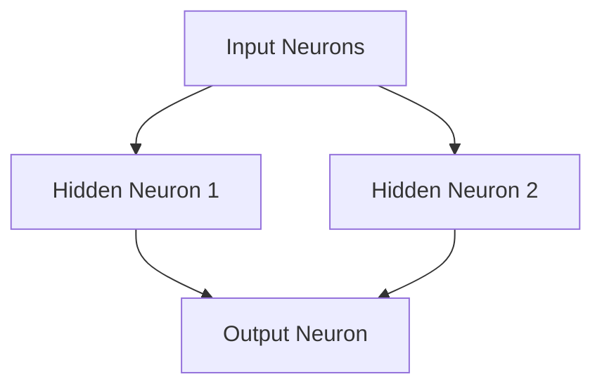

# Documentazione della Rete Neurale

## Introduzione

La rete neurale implementata in questo progetto è un modello semplice ma potente per l'apprendimento automatico. Utilizza il concetto di neuroni artificiali e algoritmi di backpropagation per addestrare la rete a riconoscere schemi nei dati di input e generare previsioni accurate.

## Architettura della Rete Neurale

La rete neurale è composta da uno o più strati di neuroni artificiali. Ogni strato è collegato al successivo tramite pesi sinaptici. L'input fluisce attraverso la rete in avanti, mentre i segnali di errore vengono propagati all'indietro per aggiornare i pesi dei neuroni.

### Esempio di Architettura della Rete Neurale

Utilizziamo un grafico Mermaid per visualizzare un esempio di architettura di una rete neurale con 2 neuroni di input, 1 neurone di output e 2 neuroni nascosti:

Nell'esempio sopra, gli input vengono propagati attraverso due neuroni nascosti e infine raggiungono il neurone di output.

## Funzionamento dei Neuroni

I neuroni artificiali sono le unità di calcolo fondamentali della rete neurale. Ricevono input ponderati, eseguono una somma pesata dei valori di input e applicano una funzione di attivazione per generare un output.

### Calcolo del Neurone

Il calcolo di un neurone avviene in due fasi: la somma pesata dei valori di input e l'applicazione della funzione di attivazione. La somma pesata è data dalla seguente formula matematica:

$Somma Pesata=i=1∑n​wi​⋅xi​+b$

Dove $w_i$ sono i pesi sinaptici, $x_i$ sono i valori di input e $b$ è il bias.

### Funzione di Attivazione

La funzione di attivazione determina l'output del neurone in base alla somma pesata dei valori di input. Esistono diverse funzioni di attivazione, ma una delle più comuni è la funzione sigmoide:

$Output=1+e−Somma Pesata1​$

La funzione sigmoide comprime i valori in un intervallo compreso tra 0 e 1, consentendo alla rete neurale di produrre output probabilistici.

## Addestramento della Rete Neurale

Il processo di addestramento della rete neurale coinvolge due fasi principali: il calcolo dell'errore e la propagazione all'indietro.

### Calcolo dell'Errore

Durante l'addestramento, è necessario calcolare l'errore tra l'output previsto dalla rete neurale e il valore di output desiderato. L'errore può essere calcolato utilizzando diverse metriche, ma una delle più comuni è l'errore quadratico medio (MSE):

$MSE=n1​i=1∑n​(yi​−y^​i​)2$

Dove $y_i$ rappresenta il valore di output desiderato e $\hat{y}_i$ rappresenta l'output previsto dalla rete neurale per l'input corrispondente.

### Propagazione all'Indietro (Backpropagation)

Una volta calcolato l'errore, viene eseguita la propagazione all'indietro per aggiornare i pesi dei neuroni e migliorare le prestazioni della rete neurale. Durante la propagazione all'indietro, l'errore viene retropropagato attraverso i neuroni, e i pesi vengono aggiornati in base alla loro contribuzione all'errore.

L'aggiornamento dei pesi durante la backpropagation avviene utilizzando il metodo del gradiente discendente. I pesi vengono aggiornati in direzione opposta al gradiente dell'errore rispetto ai pesi. L'aggiornamento dei pesi avviene secondo la seguente formula:

$w_{ij}​=w_{ij}+η⋅δj​⋅xi​$

Dove $w_{ij}$ rappresenta il peso tra il neurone di input $i$ e il neurone di output $j$, $\eta$ è il tasso di apprendimento e $\delta_j$ è l'errore del neurone di output $j$.

### Allenamento della Rete Neurale

Durante l'allenamento della rete neurale, il dataset di addestramento viene presentato alla rete uno dopo l'altro. Per ogni esempio di addestramento, l'output previsto viene confrontato con il valore di output desiderato e viene calcolato l'errore. Successivamente, l'errore viene retropropagato attraverso la rete utilizzando la backpropagation e i pesi vengono aggiornati di conseguenza.

Questo processo viene ripetuto per un numero specificato di epoche, durante le quali la rete neurale impara ad adattarsi ai dati di addestramento e ridurre l'errore complessivo.

## Utilizzo del Progetto

Per utilizzare il progetto e addestrare una rete neurale, seguire i seguenti passaggi:

1.  Assicurarsi di avere Python installato sul proprio sistema.
    
2.  Clonare il repository del progetto da GitHub.
    
3.  Installare le dipendenze necessarie eseguendo il comando:
    
    `pip install -r requirements.txt` 
    
4.  Modificare il file `main.py` se necessario per personalizzare l'architettura della rete neurale, il dataset di addestramento, il numero di epoche, il tasso di apprendimento, ecc.
    
5.  Eseguire il programma utilizzando il comando:
    
    `python main.py`
    
6.  Durante l'esecuzione del programma, verranno visualizzati i dettagli dell'addestramento, compresa l'epoca corrente, l'errore medio e altri parametri di monitoraggio.
    
7.  Alla fine dell'addestramento, verranno generati output per un insieme di input casuali, mostrando i risultati della rete neurale.
    
8.  Se si desidera salvare il modello addestrato, è possibile utilizzare l'opzione `--save_model` durante l'esecuzione del programma. Il modello verrà salvato nel file specificato nel parametro `--model_file`.
    

## Conclusioni

La documentazione fornisce una panoramica dettagliata del funzionamento della rete neurale implementata nel progetto. Sono state spiegate l'architettura della rete, il funzionamento dei neuroni, il processo di addestramento e l'utilizzo del progetto.

Utilizzando questa documentazione, gli utenti possono comprendere come utilizzare il progetto per addestrare una rete neurale semplice ma potente. Possono anche personalizzare l'architettura della rete, il dataset di addestramento e altri parametri per adattarli alle proprie esigenze.

Speriamo che questa documentazione sia utile per comprendere e utilizzare il progetto. Per ulteriori informazioni e dettagli, consultare il codice sorgente e i commenti nel repository GitHub.
